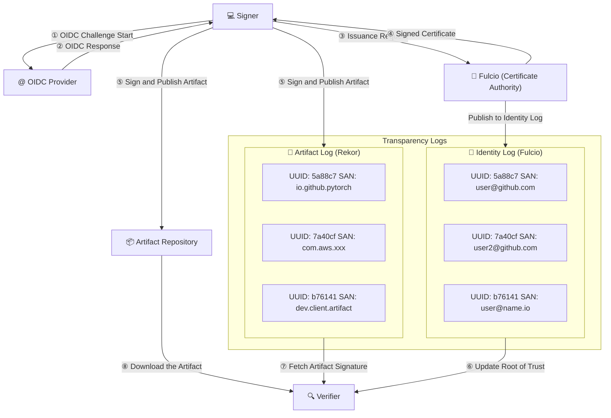

# Cosign Verifier

## Introduction

In order to provide signatures over arbitrary artifacts, Sigstore performs three major operations[1]:

1. OIDC Issuance, vouch that a client is in control of an identity
2. Associate short-lived public key certificates with these identities (from a Certificate Authority), and publish these certificates to an Identity Log.
3. Publish a long-lived signature over an artifact (or artifact meta-data) to an Artifact Log, allowing verifiers to check its validity.

The first and second operations are performed by a system called Fulcio, which functions as a Certificate Authority and transparency log for a namespace of OIDC identities (Identity Log).
The third operation is performed by a system called Rekor, a transparency log for artifact signatures (Artifact Log).
And cosign is the reference Sigstore client implementation to sign arbitrary artifacts. With these components, Sigstore completed trust setup, signing and verification[2].

To verify an artifact, a verifier ensures that the trusted keys are fresh by performing a key update. With an updated root-of-trust, the first check ensures that the identity claimed was correctly verified by the identity log, and that the signature provided matches the content of the signed artifact. A final check verifies that the signature was created during the time window in which the certificate was valid.

The Sigstore team plans to refactor parts of cosign into a new, minimal, and user-friendly API named `sigstore-go`. Currently in beta, `sigstore-go` has passed the `sigstore-conformance` signing and verification test suite.
`sigstore-go` is built as a modular Go codebase including cryptographic signature creation and validation, integration with external services (Fulcio for certificates and Rekor for record-keeping) and API layers.
The `ratify-verifier-go` implementation shares the same underlying library, `sigstore-go`, as the cosign verifier.

## Concepts

1. Digital Artifact Signing Fundamentals
    - Artifact Signing: The process by which a signer uses a private key (paired with a public key) to produce a digital signature on an artifact (a piece of data, file, or software).  
    - Digital Signature: A cryptographic value computed from artifact data and a secret key. It serves as evidence that the signer endorsed the artifact and that the artifact has not been tampered with.

2. Identity, Authorization, and Trust Establishment
    - OpenID Connect (OIDC): A widely supported protocol that allows relying parties (applications) to authenticate resource owners (end users) based on assertions made by identity providers.
    - OIDC Provider: An entity or mechanism that vouches for an individual’s identity (for example, confirming control of an email account) in accordance with OIDC protocols.
    - Signers: Individuals or entities that use their private keys to digitally sign artifacts, thereby vouching for the authenticity and integrity of content.
    - Verifiers: Individuals or systems responsible for checking that the digital signature attached to an artifact is valid and that the artifact remains unaltered.

3. Trust Infrastructure and Public-Key Management
    - Certificate Authority (CA): An entity within a Public-key Infrastructure (PKI) that is responsible for verifying identities and issuing digital certificates which associate a public key with the verified identity of a signer.
    - Public Key Certificate: An electronic document issued by a CA that binds a public key with an individual’s identity, thus providing proof of the public key’s legitimacy.
    - Public-key Infrastructure (PKI): A comprehensive framework that includes roles, policies, hardware, software, and procedures for creating, managing, distributing, using, storing, and revoking digital certificates as well as managing public-key encryption.

4. Transparency and Auditability
    - Identity Log: An online provided record, that maps verified identities to their associated signing keys. Such logs help establish trust by providing a history of key associations.
    - Artifact Log: An online/offline provided record that contains metadata about artifacts, such as when and by whom they were signed. This ledger aids in auditing and tracing the provenance of digital artifacts.

## Scenarios

`ratify-verifier-go` supports multiple verification scenarios based on different signing methods, artifact types, and trust sources[3]. These scenarios can be categorized into the following main types.

| **Verification Scenario**         | **Purpose**                                                            | **Use Case**                                                                 |
|-----------------------------------|------------------------------------------------------------------------|-----------------------------------------------------------------------------|
| **Keyless Verification**          | Verifyies signatures from Rekor, trust material (signed certificate timestamp) from the CT log, and certificates that chain up to Fulcio. | CI/CD pipelines or automated workflows where no private key management is needed. |
| **Key-Based Verification**        | Verifies signature using a known **public key**.                        | Environments where signatures are verified with a known public key. |
| **Timestamp Verification**        | Verifies the **timestamp** of the signature to prevent time-based attacks. Not standalone verification. | Long-term signature validity checks, ensuring signatures are valid at a specific point in time. |
| **Rekor Transparency Log (TLog)** | Verifies inclusion of the signature in the **Rekor Transparency Log** for audibility. Not standalone verification. | Auditing and compliance to ensure signatures are publicly recorded in an immutable log. |

### Cosign Verifier Input

1. The Artifact to Verify
    - The artifact in OCI-compliant registries.

2. Verification Materials
    - The signature(s) of the artifact[4]: The cryptographic signature(s) created when the artifact was signed.
    - Verification options: i.e. whether to expect signed certificate timestamps (SCTs), TLog entries, or signed timestamps and expected identity and digest to verify.

3. Verification Key or Certificate
    - Keyless Verification: Retrieves an X.509[5] certificate on the signature and verify against Fulcio root trust.
    - Key-Based Verification: User provides a public key, certificate or certificate chain.

### Cosign Verifier Output

The output format is defined by `ratify-go`, illustrates if the signature is valid and all criteria are met. It includes detailed information such as:

- verification_success: Indicates if the verification was successful.
- verifier reference:  The verifier that generated the result.
- artifact_digest: The cryptographic hash of the artifact.
- signer_identity: The identity associated with the signing certificate (if keyless signing was used).
- signing_cert: Metadata about the Fulcio-issued certificate (if applicable).
- rekor_entry: Confirms whether the signature exists in the transparency log (for keyless verification).
- timestamp_verified: Ensures that the signature has a valid timestamp (if timestamping was used).

## References

[1] [Zachary Newman, John Speed Meyers, and Santiago Torres-Arias. 2022. Sigstore: software signing for everybody. In Proceedings of the 2022 ACM SIGSAC Conference on Computer and Communications Security. 2353–2367](https://doi.org/10.1145/3548606.3560596)

[2] [Sigstore Security Model](https://docs.sigstore.dev/about/security/)

[3] [Cosign Verifying Signatures Description](https://docs.sigstore.dev/cosign/verifying/verify)

[4] [Cosign Signature Spec](https://github.com/sigstore/cosign/blob/release-1.13/specs/SIGNATURE_SPEC.md)

[5] [M. Cooper, Y. Dzambasow, P. Hesse, S. Joseph, and R. Nicholas. 2005. Internet X.509 Public Key Infrastructure: Certification Path Building (RFC 5280). Technical Report. Internet Engineering Task Force. http://tools.ietf.org/html/rfc5280](http://tools.ietf.org/html/rfc5280)
