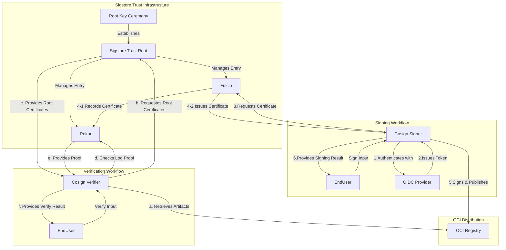

# Cosign Library Grossary

## Introduction

In order to provide signatures over arbitrary artifacts, Sigstore performs three major operations:

1. Introduce an OpenID Connect (OIDC) Provider, assure that a client is in control of an identity
2. Issue short-lived public-key certificates with these identities (from a Certificate Authority), and publish these certificates to an Identity Log.
3. Publish a signature over an artifact (or artifact meta-data) to an Artifact Log, allowing verifiers to check its validity.

The first and second operations are performed by a system called **Fulcio**, which functions as a Certificate Authority and transparency log for a namespace of OIDC identities (Identity Log). The third operation is performed by a system called **Rekor**, a transparency log for artifact signatures (Artifact Log). And **Cosign** is the reference Sigstore client implementation to sign arbitrary artifacts. With these components, Sigstore completed trust setup, signing and verification.

Sigstore compares a tuple of signature, key/certificate, and artifact from the timestamped object against the timestamped Rekor entry. If they match, it confirms that the signature is valid because the user knows that the expected software creator, whose identity was certified at the moment of signing, published the software artifact in their possession.

NOTE: The Sigstore team plans to refactor parts of Cosign into a new, minimal, and user-friendly API named `sigstore-go`. Currently in beta, `sigstore-go` has passed the `sigstore-conformance` signing and verification test suite.
`sigstore-go` is built as a modular Go codebase including cryptographic signature creation and validation, integration with external services (Fulcio for certificates and Rekor for record-keeping) and API layers. The `ratify-verifier-go` implementation shares the same underlying library, `sigstore-go`, as the Cosign verifier.

## Concepts

1. Digital Artifact Signing Fundamentals
    - Artifact Signing: The process by which a signer uses a private key (paired with a public key) to produce a digital signature on an artifact (a piece of data, file, or software).  
    - Digital Signature: A value computed with a cryptographic algorithm and associated with a data object in such a way that any recipient of the data can use the signature to verify the data's origin and integrity.

2. Identity, Authorization, and Trust Establishment
    - OpenID Connect (OIDC): A widely supported protocol that allows relying parties (applications) to authenticate resource owners (end users) based on assertions made by identity providers.
    - OIDC Provider: An entity or mechanism that guarantees for an individual's identity (for example, confirming control of an email account) in accordance with OIDC protocols.
    - Signers: Individuals or entities that use their private keys to digitally sign artifacts, thereby assuring for the authenticity of content.
    - Verifiers: Individuals or systems responsible for checking that the digital signature attached to an artifact is valid and that the artifact remains unaltered.

3. Trust Infrastructure and Public-Key Management
    - Certificate Authority (CA): An entity within a Public-key Infrastructure (PKI) that is responsible for verifying identities and issuing digital certificates which associate a public key with the verified identity of a signer.
    - Public Key: The publicly disclosable component of a pair of cryptographic keys used for asymmetric cryptography.
    - Public-key Certificate: A public-key certificate binds a subject name to a public key value, along with information needed to perform certain cryptographic functions using that key.
    - Public-key Infrastructure (PKI): A system of CAs (and, optionally, RAs and other supporting servers and agents) that perform some set of certificate management, archive management, key management, and token management functions for a community of users in an application of asymmetric cryptography. The core PKI functions are (a) to register users and issue their public-key certificates, (b) to revoke certificates when required, and (c) to archive data needed to validate certificates at a much later time.

4. Transparency and Auditability
    - Identity Log: An online provided record, that maps verified identities to their associated signing keys. Such logs help establish trust by providing a history of key associations.
    - Artifact Log: An online/offline provided record that contains metadata about artifacts, such as when and by whom they were signed. This ledger aids in auditing and tracing the provenance of digital artifacts.
    - Timestamps: Time is a critical component of Sigstore. It’s used to verify that a short-lived certificate issued by Fulcio was valid at a previous point, when the artifact was signed.

## Scenarios

`ratify-verifier-go` supports multiple verification scenarios based on different signing methods, artifact types, and trust sources. These scenarios can be categorized into the following main types.

| Verification Scenario             | Purpose                                                                | Use Case                                                                    |
|-----------------------------------|------------------------------------------------------------------------|-----------------------------------------------------------------------------|
| **Keyless Verification**          | Verifies signatures from Rekor, trust material (signed certificate timestamp) from the CT log, and certificates that chain up to Fulcio. | CI/CD pipelines or automated workflows where no private key management is needed. |
| **Key-Based Verification**        | Verifies signature using a known **public key**.                        | Using an on-disk public key, or a key provided by other providers (e.g., "KMS provider") |
| **Transparency Log Verification** | Verifies inclusion of the signature in the **Rekor Transparency Log** for audibility. Not standalone verification. | Checked the Rekor Transparency Log to ensure signatures are publicly recorded. |
| **Timestamp Verification**        | Verifies the **timestamp** of the signature to prevent time-based attacks. Not standalone verification. | Sigstore clients relying on Rekor to provide the timestamp use the entry’s inclusion time. Sigstore also supports signed timestamps. Trusted Timestamp Authorities (TSAs) issue signed timestamps following the RFC 3161 specification. |

### Cosign Library Keyless Input

1. The Artifact to Verify
    - The OCI subject.

2. Verification Materials
    - Identity Parameters: Restrict verification to specific OIDC identities. Valid values include email address, DNS names, IP addresses, and URIs.
    - OIDC Issuer Parameters: Ensure the certificate was issued by a specific OIDC provider, without Fulcio roots (for BYO PKI).
    - Certificate Chain(Optional): Provide user-provided trusted chain for verification.
    - Rekor URL(Optional): Specify a custom Rekor instance, default value is `https://rekor.sigstore.dev`.

### Cosign Library Key-based Verify Input

1. The Artifacts to Verify
    - The OCI subject.

2. Verification Materials
    - Public Key: The public key in PEM format, corresponding to the private key used to sign the artifact.
    - Certificate Chain(Optional): Provide user-provided trusted chain for verification.
    - Rekor URL(Optional): Specify a custom Rekor instance, default value is `https://rekor.sigstore.dev`.

NOTE: With OCI artifacts, the signatures and certificates are attached to the OCI artifacts by default.

### Cosign Verify Output

The output format is defined by `ratify-go`, illustrates if the signature is valid and all criteria are met. It includes detailed information such as:

- Err: Err is the error that occurred when the verification failed. If the verification is successful, this field should be nil.
- Description: Indicates if the verification was successful.
- Verifier:  The verifier that generated the result.
- Details(Optional):
        - artifact_digest: The cryptographic hash of the artifact.
        - signer_identity: The identity associated with the signing certificate.
        - signing_cert: Metadata about the Fulcio-issued certificate.
        - rekor_entry: Confirms whether the signature exists in the transparency log.
        - timestamp_verified: Ensures that the signature has a valid timestamp.

## References

- Zachary Newman, John Speed Meyers, and Santiago Torres-Arias. 2022. Sigstore: software signing for everybody. In Proceedings of the 2022 ACM SIGSAC Conference on Computer and Communications Security. 2353-2367. [https://doi.org/10.1145/3548606.3560596](https://doi.org/10.1145/3548606.3560596)

- [Sigstore Security Model](https://docs.sigstore.dev/about/security/)

- [Cosign Verifying Signatures Description](https://docs.sigstore.dev/cosign/verifying/verify)

- [Cosign Signature Spec](https://github.com/sigstore/cosign/blob/v2.4.3/specs/SIGNATURE_SPEC.md)

- [Tooling](https://docs.sigstore.dev/about/tooling/)

- [RFC 5280: Internet X.509 Public Key Infrastructure Certificate and Certificate Revocation List (CRL) Profile](http://tools.ietf.org/html/rfc5280)

- [RFC 4949: Internet Security Glossary, Version 2](https://www.rfc-editor.org/rfc/rfc4949)
