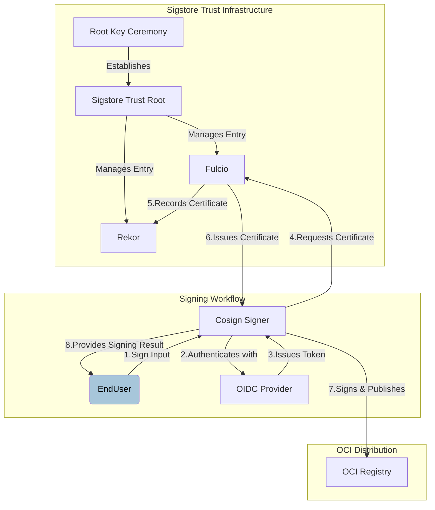
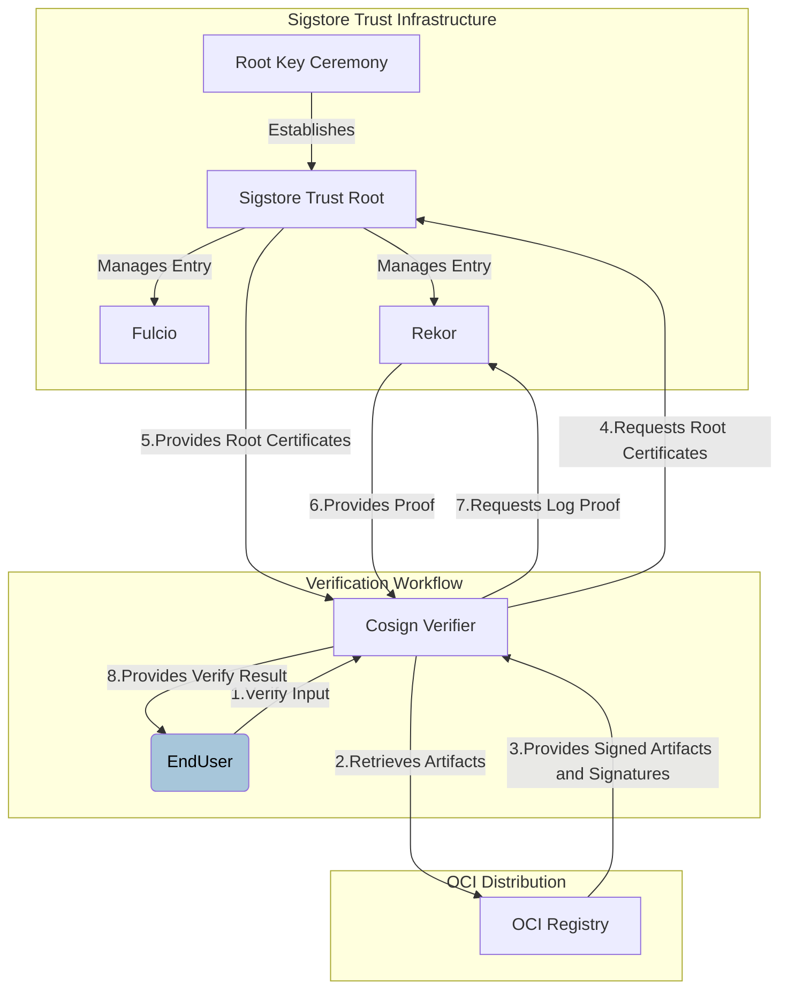

# Cosign Library Glossary

## Introduction

In order to provide signatures over arbitrary artifacts, Sigstore performs three major operations:

1. Introduce an OpenID Connect (OIDC) Provider, assure that a client is in control of an identity.
2. Issue short-lived public-key certificates with these identities (from a Certificate Authority), and publish these certificates to an Identity Log.
3. Publish a signature over an artifact (or artifact meta-data) to an Artifact Log, allowing verifiers to check its validity.

The first and second operations are performed by a system called **Fulcio**, which functions as a Certificate Authority and transparency log for a namespace of OIDC identities (Identity Log). The third operation is performed by a system called **Rekor**, a transparency log for artifact signatures (Artifact Log). And **Cosign** is the reference Sigstore client implementation to sign arbitrary artifacts. With these components, Sigstore completed trust setup, signing and verification.

### Sign Workflow

Following graph explains how general signing works in Sigstore. Fulcio issues short-lived certificates binding an ephemeral key to an OpenID Connect identity. Signing events are logged in Rekor, a signature transparency log, providing an auditable record of when a signature was created.
Sigstore’s root of trust, which includes Fulcio’s root CA certificate and Rekor’s public key, are distributed by The Update Framework (TUF).



### Verify Workflow

Sigstore compares a tuple of signature, key/certificate, and artifact from the timestamped object against the timestamped Rekor entry. If they match, it confirms that the signature is valid because the user knows that the expected software creator, whose identity was certified at the moment of signing, published the software artifact in their possession.



> [!NOTE]
> The Sigstore team plans to refactor parts of Cosign into a new, minimal, and user-friendly API named `sigstore-go`. Currently in beta, `sigstore-go` has passed the `sigstore-conformance` signing and verification test suite.
`sigstore-go` is built as a modular Go codebase including cryptographic signature creation and validation, integration with external services (Fulcio for certificates and Rekor for record-keeping) and API layers. The `ratify-verifier-go` implementation shares the same underlying library, `sigstore-go`, as the Cosign verifier.

## Concepts

1. Digital Artifact Signing Fundamentals
    - Artifact Signing: The process by which a signer uses a private key (paired with a public key) to produce a digital signature on an artifact (a piece of data, file, or software).  
    - Digital Signature: A value computed with a cryptographic algorithm and associated with a data object in such a way that any recipient of the data can use the signature to verify the data's origin and integrity.

2. Identity, Authorization, and Trust Establishment
    - OpenID Connect (OIDC): A widely supported protocol that allows relying parties (applications) to authenticate resource owners (end users) based on assertions made by identity providers.
    - OIDC Provider: An entity or mechanism that guarantees for an individual's identity (for example, confirming control of an email account) in accordance with OIDC protocols.
    - Signers: Individuals or entities that use their private keys to digitally sign artifacts, thereby assuring for the authenticity of content.
    - Verifiers: Individuals or systems responsible for checking that the digital signature attached to an artifact is valid and that the artifact remains unaltered.

3. Trust Infrastructure and Public-Key Management
    - Certificate Authority (CA): An entity within a Public-key Infrastructure (PKI) that is responsible for verifying identities and issuing digital certificates which associate a public key with the verified identity of a signer.
    - Public Key: The publicly disclosable component of a pair of cryptographic keys used for asymmetric cryptography.
    - Public-key Certificate: A public-key certificate binds a subject name to a public key value, along with information needed to perform certain cryptographic functions using that key.
    - Public-key Infrastructure (PKI): A system of CAs (and, optionally, RAs and other supporting servers and agents) that perform some set of certificate management, archive management, key management, and token management functions for a community of users in an application of asymmetric cryptography. The core PKI functions are (a) to register users and issue their public-key certificates, (b) to revoke certificates when required, and (c) to archive data needed to validate certificates at a much later time.
    > **NOTE**: Cosign's keyless scenario does not follow the PKI model.
    - Root CA: The root CA in a certification hierarchy issues public-key certificates to one or more additional CAs that form the second-highest level. Each of these CAs may issue certificates to more CAs at the third-highest level, and so on. To initialize operation of a hierarchical PKI, the root's initial public key is securely distributed to all certificate users in a way that does not depend on the PKI's certification relationships.
    - Root of Trust: Sigstore’s root of trust, which includes Fulcio’s root CA certificate and Rekor’s public key, are distributed by The Update Framework (TUF). TUF is a framework to provide secure software and file updates.
    - Trust Anchor: A trust anchor may be defined as being based on a public key, a CA, a public-key certificate, or some combination or variation of those. The trusted anchor information is trusted because it was delivered to the path processing procedure by some trustworthy out-of-band procedure.

4. Transparency and Auditability
    - TOFU: Trust on first use(TOFU) is an authentication system used to bootstrap trust between two entities on an untrusted network.
    - Identity Log: An online provided record, that maps verified identities to their associated signing keys. Such logs help establish trust by providing a history of key associations.
    - Artifact Log: An online/offline provided record that contains metadata about artifacts, such as when and by whom they were signed. This ledger aids in auditing and tracing the provenance of digital artifacts.
    - Timestamps: Time is a critical component of Sigstore. It’s used to verify that a short-lived certificate issued by Fulcio was valid at a previous point, when the artifact was signed.

## Scenarios

`ratify-verifier-go` supports multiple verification scenarios based on different signing methods and trust sources. These scenarios can be categorized into the following main types.

| Scenario             | Purpose                                                                | Use Case                                                                    |
|-----------------------------------|------------------------------------------------------------------------|-----------------------------------------------------------------------------|
| **Keyless Verification**          | Verifies signatures against Rekor, trust material (signed certificate timestamp) from the CT log, and certificates that chain up to Fulcio. | CI/CD pipelines or automated workflows where no private key management is needed. |
| **Key-Based Verification**        | Verifies signature using a known **public key**.                        | Using an on-disk public key, or a key provided by other providers (e.g., "KMS provider") |

### Cosign Library Keyless Verify

To verify a keyless signed Cosign signature, you need to verify the following trust chain:

- Check if the artifact matches what is described in the signature
- Check if the OIDC identity (subject & issuer) matches what is described in the signature
- Check if the certificate and the timestamp in signature are valid against Fulcio and Rekor
- The root trust of Fulcio and Rekor is sourced from https://tuf-repo-cdn.sigstore.dev/
- The root trust of https://tuf-repo-cdn.sigstore.dev/ is from the Cosign binary

> [!NOTE]
> With a short-lived certificate with timestamping, the trust has been completely shifted to Fulcio and Rekor of the Sigstore.
> To resolve the TOFU issue of the TUF, Cosign pins the trust by embedding the current latest `root.json`, which contains the public key of the root role of the TUF, into the Cosign binary at the build time.

#### Keyless Verify Input

1. The Artifact to Verify
    - The OCI subject.

2. Verification Materials
    - Identity Parameters: Restrict verification to specific OIDC identities. Valid values include email address, DNS names, IP addresses, and URIs.
    - OIDC Issuer Parameters: Ensure the certificate was issued by a specific OIDC provider.
    > **NOTE**: Non-Fulcio roots are supported in bring your own (BYO) PKI scenario.

#### Keyless Verify Output

The output format illustrates if the signature is valid and all criteria are met.

Here is a sample output for the keyless verify, and following checks were performed:

- The Cosign claims were validated
- Existence of the claims in the transparency log was verified offline
- The code-signing certificate was verified using trusted certificate authority certificates

```shell
[
  {
    "critical": {
      "identity": {
        "docker-reference": "localhost:5001/shus"
      },
      "image": {
        "docker-manifest-digest": "sha256:ebb69020bc393de0b7b375fd27ab9ff0740937e35149a35484aebe842229d94f"
      },
      "type": "cosign container image signature"
    },
    "optional": {
      "1.3.6.1.4.1.57264.1.1": "https://github.com/login/oauth",
      "Bundle": {
        "SignedEntryTimestamp": "MEUCIQDP74pqAwKV3yCqffy2jknotmTV/AOdh0QxmlaPLeCCagIgWzvRxrO4smLIEmAfNfMeWZDPWfc/wX8TWmdU9C0gff4=",
        "Payload": {
          "body": "eyJhcGlWZXJzaW9uIjoiMC4wLjEiLCJraW5kIjoiaGFzaGVkcmVrb3JkIiwic3BlYyI6eyJkYXRhIjp7Imhhc2giOnsiYWxnb3JpdGhtIjoic2hhMjU2IiwidmFsdWUiOiJiNDc4MGViZTliOTI2YWY1MmVhYTU5ZWU4OWI2NThiOWNlYzJlN2ZhMWRjYjMzODY5OTIyN2ZlNGY0NjA4NjRmIn19LCJzaWduYXR1cmUiOnsiY29udGVudCI6Ik1FVUNJSEo2UE03YUJpODQzeTVBU3crRzV2c0VvN2JPR1hTcWhHVWdRMTk4Yzl4M0FpRUF4bjJZY0dmdURweWgySjVCQ0g5SkxzR0pEY3lnN1BmMHN6QytsOTJWYkhRPSIsInB1YmxpY0tleSI6eyJjb250ZW50IjoiTFMwdExTMUNSVWRKVGlCRFJWSlVTVVpKUTBGVVJTMHRMUzB0Q2sxSlNVTXdla05EUVd4dFowRjNTVUpCWjBsVlV6QlpaamN2UkdNd0wyaHJhVGxHTjAxMlRsTkVNSE54V1dObmQwTm5XVWxMYjFwSmVtb3dSVUYzVFhjS1RucEZWazFDVFVkQk1WVkZRMmhOVFdNeWJHNWpNMUoyWTIxVmRWcEhWakpOVWpSM1NFRlpSRlpSVVVSRmVGWjZZVmRrZW1SSE9YbGFVekZ3WW01U2JBcGpiVEZzV2tkc2FHUkhWWGRJYUdOT1RXcFZkMDE2UlRKTlZFMHhUbFJSTTFkb1kwNU5hbFYzVFhwRk1rMVVVWGRPVkZFelYycEJRVTFHYTNkRmQxbElDa3R2V2tsNmFqQkRRVkZaU1V0dldrbDZhakJFUVZGalJGRm5RVVZYZEc5Q0wyVTFZVWMwVEVoTVV6QXhNMEZCWjBNM2NXbHpha1E1VFd0TGQyMUZaRXdLTjFFek5VdHZaMmw0UjNwSFpWWlJVekJGUkhadldrcFFaMlp2V1ZVd1NGRk5TRXgyTlhSb2VXUkNVVzQ1UWpSR1RIRlBRMEZZWjNkblowWXdUVUUwUndwQk1WVmtSSGRGUWk5M1VVVkJkMGxJWjBSQlZFSm5UbFpJVTFWRlJFUkJTMEpuWjNKQ1owVkdRbEZqUkVGNlFXUkNaMDVXU0ZFMFJVWm5VVlV3VWpKRUNsWTNiVUVyWlRoTlprbHhVbkpIU0Zod2FHcHVTV2c0ZDBoM1dVUldVakJxUWtKbmQwWnZRVlV6T1ZCd2VqRlphMFZhWWpWeFRtcHdTMFpYYVhocE5Ga0tXa1E0ZDBsM1dVUldVakJTUVZGSUwwSkNhM2RHTkVWV1lXNVdkVmt6Y0c5a1ZVSjBZVmRPZVdJelRuWmFibEYxV1RJNWRFMURkMGREYVhOSFFWRlJRZ3BuTnpoM1FWRkZSVWh0YURCa1NFSjZUMms0ZGxveWJEQmhTRlpwVEcxT2RtSlRPWE5pTW1Sd1ltazVkbGxZVmpCaFJFRjFRbWR2Y2tKblJVVkJXVTh2Q2sxQlJVbENRMEZOU0cxb01HUklRbnBQYVRoMldqSnNNR0ZJVm1sTWJVNTJZbE01YzJJeVpIQmlhVGwyV1ZoV01HRkVRMEpwVVZsTFMzZFpRa0pCU0ZjS1pWRkpSVUZuVWpkQ1NHdEJaSGRDTVVGT01EbE5SM0pIZUhoRmVWbDRhMlZJU214dVRuZExhVk5zTmpRemFubDBMelJsUzJOdlFYWkxaVFpQUVVGQlFncHNXamc1VW05UlFVRkJVVVJCUlZsM1VrRkpaMkZqUVdaTE9EaEtORVZuV0dGcGEwcGtWRkJaWmpCUGVrSjFNRFoxUld4UFYxQkRVVTAwYVhKR2VGbERDa2xFTURGdUwydEpaell2VFhCWGEyMUhUM0JuVm5ocVZGUTJiR2M0VjBST2ExVkJZVWxxYzI1RVVpOURUVUZ2UjBORGNVZFRUVFE1UWtGTlJFRXlaMEVLVFVkVlEwMUNibXQxWWtSRVExQnFibGMwTUdwMWQzUjFMM0Z4UkRaNE0xTlNjMDk1ZWxkYVlrbGpWM1JwUkZONlQxb3lWMlpMVTJ3MFJFRjJORTh5U3dwRGNsbG5VRkZKZUVGTlN5czNTR0Z1ZDNOcGRqRmlNWFZTTVVsd0x6TXhhV0ZFTTJkd1dYUnBjMUYxY2s1RlMxcHNXRU5qVm1WMWRUVTNZMnBDUVc1R0NscGpZMWxYTVVsdWIxRTlQUW90TFMwdExVVk9SQ0JEUlZKVVNVWkpRMEZVUlMwdExTMHRDZz09In19fX0=",
          "integratedTime": 174213348,
          "logIndex": 18030X718,
          "logID": "c0d23d6ad406973f9559f3ba2d1ca01f84147d8ff5cb8445c224f98b9591810d"
        }
      },
      "Issuer": "https://github.com/login/oauth",
      "Subject": "user@example.com"
    }
  }
]
```

### Cosign Library Key-based Verify

Cosign signs the artifact with the private key and upload the signature transparency log to the Rekor server `rekor.sigstore.dev`
To verify a key-based signed Cosign signature, you need to verify the following trust chain:

- Check if the artifact matches what is described in the signature
- Check if the signature was created using the expected public key

#### Key-based Verify Input

1. The Artifacts to Verify
    - The OCI subject.

2. Verification Materials
    - Public Key: The public key in PEM format, corresponding to the private key used to sign the artifact.

> [!NOTE]
> With OCI artifacts, the signatures and certificates are attached to the OCI artifacts by default.

#### Key-based Verify Output

Here is a sample output for the key-based verify, and following checks were performed:

- The Cosign claims were validated
- Existence of the claims in the transparency log was verified offline
- The signatures were verified against the specified public key

```shell
[
  {
    "critical": {
      "identity": {
        "docker-reference": "localhost:5001/al"
      },
      "image": {
        "docker-manifest-digest": "sha256:ec1b05d1eac264d9204a57f4ad9d4dc35e9e756e9fedaea0674aefc7edb1d6a4"
      },
      "type": "cosign container image signature"
    },
    "optional": {
      "Bundle": {
        "SignedEntryTimestamp": "MEUCIFaLz/jfslFQu+hn+GcNiAR0zPTwmj3DWaMSoW4F+FNTAiEA0WFBwTc8dtQbYoqF1qFyHJ00tS8Mciz0w7s0GtHS3ew=",
        "Payload": {
          "body": "eyJhcGlWZXJzaW9uIjoiMC4wLjEiLCJraW5kIjoiaGFzaGVkcmVrb3JkIiwic3BlYyI6eyJkYXRhIjp7Imhhc2giOnsiYWxnb3JpdGhtIjoic2hhMjU2IiwidmFsdWUiOiI0NTMxZWRmZWJmMzBmOWM3M2U1OTM3YjljYjExZTgyNjRjMGFhN2VhMzc1ZTcyZTUzYTc4MDJkMjQyZmJiMjdmIn19LCJzaWduYXR1cmUiOnsiY29udGVudCI6Ik1FVUNJUUN6K2IzOGpqVzhyZXo0dm1yTEZPMVRCdUhPZFF3bE55U1pRYndqSisvS1ZnSWdKVDBTOTF0Q3R3dVBlblAxZkJ6TjNlbmQ3Unc5NEhqM0RmQW1TY2t6V29ZPSIsInB1YmxpY0tleSI6eyJjb250ZW50IjoiTFMwdExTMUNSVWRKVGlCUVZVSk1TVU1nUzBWWkxTMHRMUzBLVFVacmQwVjNXVWhMYjFwSmVtb3dRMEZSV1VsTGIxcEplbW93UkVGUlkwUlJaMEZGTkhSbVlrbFFha2xQYmpWYU5YQkpSa3QxVWlzMWJ6STBhblp3TUFwMWJUWjFRVmhzTkV0NlNYZElWbWRLTmpoemVWRlhjWE5TVldwQ00yTkZUVWxSZGxNelF6bEVVME5OT0dWdlUxTlNaelJrV21kWWFFRkJQVDBLTFMwdExTMUZUa1FnVUZWQ1RFbERJRXRGV1MwdExTMHRDZz09In19fX0=",
          "integratedTime": 1742301147,
          "logIndex": 184101335,
          "logID": "c0d23d6ad406973f9559f3ba2p1ca01f84147d8ffc5b8445c224f98b9591801d"
        }
      }
    }
  }
]
```

### Verification Components

| Verification Scenario             | Purpose                                                                | Required Input                                                                    |
|-----------------------------------|------------------------------------------------------------------------|----------------------------------------------------------------------------------|
| **Cryptographic Verification** | Verifies certificate chain, root CA trustworthiness, and signature matches the public key and artifact digest. | The artifact, its signature and the trust root. |
| **Transparency Log Verification** | Verifies inclusion of the signature in the **Rekor Transparency Log** for audibility. | The artifact, its signature, the Rekor entry is optional. For identity-based verification, certificate identity and certificate OIDC issuer is required. |
| **Timestamp Verification**        | Verifies the **timestamp** of the signature to prevent time-based attacks. | Sigstore clients relying on Rekor to provide the timestamp use the entry’s inclusion time by default. Sigstore also supports signed timestamps. Trusted Timestamp Authorities (TSAs) issue signed timestamps following the RFC 3161 specification. During verification, verifiers will use the TSA’s provided certificate chain to verify signed timestamps.|

## References

- Zachary Newman, John Speed Meyers, and Santiago Torres-Arias. 2022. Sigstore: software signing for everybody. In Proceedings of the 2022 ACM SIGSAC Conference on Computer and Communications Security. 2353-2367. [https://doi.org/10.1145/3548606.3560596](https://doi.org/10.1145/3548606.3560596)
- [Sigstore Security Model](https://docs.sigstore.dev/about/security/)
- [Cosign Verifying Signatures Description](https://docs.sigstore.dev/cosign/verifying/verify)
- [Cosign Signature Spec](https://github.com/sigstore/cosign/blob/v2.4.3/specs/SIGNATURE_SPEC.md)
- [Tooling](https://docs.sigstore.dev/about/tooling/)
- [RFC 5280: Internet X.509 Public Key Infrastructure Certificate and Certificate Revocation List (CRL) Profile](http://tools.ietf.org/html/rfc5280)
- [RFC 4949: Internet Security Glossary, Version 2](https://www.rfc-editor.org/rfc/rfc4949)
