# Cosign Verifier

## Introduction

In order to provide signatures over arbitrary artifacts, Sigstore performs three major operations[1]:

1. OIDC Issuance, vouch that a client is in control of an identity
2. Associate short-lived public key certificates with these identities (from a Certificate Authority), and publish these certificates to an Identity Log.
3. Publish a long-lived signature over an artifact (or artifact meta-data) to an Artifact Log, allowing verifiers to check its validity.

The first and second operations are performed by a system called Fulcio, which functions as a Certificate Authority and transparency log for a namespace of OIDC identities (Identity Log).
The third operation is performed by a system called Rekor, a transparency log for artifact signatures (Artifact Log).
And cosign is the reference Sigstore client implementation to sign arbitrary artifacts. With these components, Sigstore completed trust setup, signing and verification[2].

```mermaid
flowchart TD
  %% OIDC Flow
  Signer["💻 Signer"] -->|① OIDC Challenge Start| OIDC["@ OIDC Provider"]
  OIDC -->|② OIDC Response| Signer
  
  %% Certificate Issuance via Fulcio
  Signer -->|③ Issuance Request| Fulcio["📜 Fulcio (Certificate Authority)"]
  Fulcio -->|④ Signed Certificate| Signer
  Fulcio -->|Publish to Identity Log| IdentityLog
  
  %% Signing & Publishing Artifacts
  Signer -->|⑤ Sign and publish Artifact| ArtifactLog
  Signer -->|⑤ Sign and publish Artifact| ArtifactRepo["📦 Artifact Repository"]
  
  %% Identity and Artifact Logs
  subgraph Logs["Transparency Logs"]
    subgraph IdentityLog["📜 Identity Log (Fulcio)"]
      ID1["UUID: 5a88c7 SAN: user#64;github.com"]
      ID2["UUID: 7a40cf SAN: user2#64;github.com"]
      ID3["UUID: b76141 SAN: user#64;name.io"]
    end
    
    subgraph ArtifactLog["📝 Artifact Log (Rekor)"]
      AID1["UUID: 5a88c7 SAN: io.github.pytorch"]
      AID2["UUID: 7a40cf SAN: com.aws.xxx"]
      AID3["UUID: b76141 SAN: dev.client.artifact"]
    end
  end

  %% Artifact Verification Flow
  ArtifactRepo -->|⑧ Download the artifact| Verifier["🔍 Verifier"]
  ArtifactLog -->|⑦ Fetch Artifact Signature|Verifier
  IdentityLog -->|⑥ Update Root of Trust|Verifier  

```

The Sigstore team plans to refactor parts of cosign into a new, minimal, and user-friendly API named `sigstore-go`. Currently in beta, `sigstore-go` has passed the `sigstore-conformance` signing and verification test suite.
`sigstore-go` is built as a modular Go codebase including cryptographic signature creation and validation, integration with external services (Fulcio for certificates and Rekor for record-keeping) and API layers.
The `ratify-verifier-go` implementation shares the same underlying library, `sigstore-go`, as the cosign verifier.

## Concepts

Artifact signing: To sign an artifact, a signer generates a private/public key pair and uses the secret key to sign an arbitrary piece of data.

Artifact Log: Record of artifact metadata created by signers.

Identity Log: Record of mappings from identities to signing keys.

OpenID Connect (OIDC): A widely-supported protocol allowing relying parties (applications) to verify the identity of resource owners (end users) as confirmed by identity providers.

Identity Provider: Mechanism vouching that an entity (individual) controls an identity (e.g., email account)

Signers: Individuals vouching for the authenticity of content.

Verifiers: Individuals checking that content is authentic.

Certificate Authority(CA): Entity verifying identity and issues cryptographic certificates to signers.

Public-key Infrastructure (PKI): A set of roles, policies, hardware, software and procedures needed to create, manage, distribute, use, store and revoke digital certificates and manage public-key encryption.

Public Key Certificate: In cryptography, a public key certificate, is an electronic document used to prove the validity of a public key.

## Scenarios

`ratify-verifier-go` supports multiple verification scenarios based on different signing methods, artifact types, and trust sources[3]. These scenarios can be categorized into the following main types.

| **Verification Scenario**         | **Purpose**                                                            | **Use Case**                                                                 |
|-----------------------------------|------------------------------------------------------------------------|-----------------------------------------------------------------------------|
| **Keyless Verification**          | Fulcio issues short-lived certificates binding an ephemeral key to an OpenID Connect identity. Signing events are logged in Rekor, a signature transparency log. | CI/CD pipelines or automated workflows where no private key management is needed. |
| **Key-Based Verification**        | Verifies signature using a known **public key**.                        | Environments where signatures are verified with a known public key. |
| **Timestamp Verification**        | Verifies the **timestamp** of the signature to prevent time-based attacks. Not standalone verification. | Long-term signature validity checks, ensuring signatures are valid at a specific point in time. |
| **Rekor Transparency Log (TLog)** | Verifies inclusion of the signature in the **Rekor Transparency Log** for audibility. Not standalone verification. | Auditing and compliance to ensure signatures are publicly recorded in an immutable log. |

### Verification Input

1. The Artifact to Verify
    - Artifacts in OCI-compliant registries.

2. Verification materials
    - The Signature(s) of the Artifact[4]. The cryptographic signature(s) created when the artifact was signed.
    - Verification options i.e. whether to expect SCTs (a service compliant with [RFC 6962](https://datatracker.ietf.org/doc/html/rfc6962)), Tlog entries, or signed timestamps and expected identity and digest to verify.

3. Verification Key or Certificate
    - Key-Based Verification: User provides a public key (e.g., PEM-encoded RSA, ECDSA, or Ed25519).
    - Keyless Verification (Fulcio-based Certificate Verification): User provides the signing certificate (issued by Fulcio).

### Verification Output

Upon successful verification—meaning the signature is valid and all criteria are met—the output includes key information such as:

- verification_success: Indicates if the verification was successful.

- artifact_digest: The cryptographic hash of the artifact.

- signer_identity: The identity associated with the signing certificate (if keyless signing was used).

- signing_cert: Metadata about the Fulcio-issued certificate (if applicable).

- rekor_entry: Confirms whether the signature exists in the transparency log (for keyless verification).

- timestamp_verified: Ensures that the signature has a valid timestamp (if timestamping was used).

If any component of the verification fails (e.g., invalid signature, missing key, revoked certificate), the verifier returns an error.

## References

[1] Zachary Newman, John Speed Meyers, and Santiago Torres-Arias, “Sigstore: Software Signing for Everybody” CCS ’22, Los Angeles, CA, USA 2353-2365 [https://doi.org/10.1145/3548606.3560596](https://doi.org/10.1145/3548606.3560596)

[2] [Sigstore Security Model](https://docs.sigstore.dev/about/security/)

[3] [Cosign Verifying Signatures Description](https://docs.sigstore.dev/cosign/verifying/verify)

[4] [Cosign Signature Spec](https://github.com/sigstore/cosign/blob/release-1.13/specs/SIGNATURE_SPEC.md)
